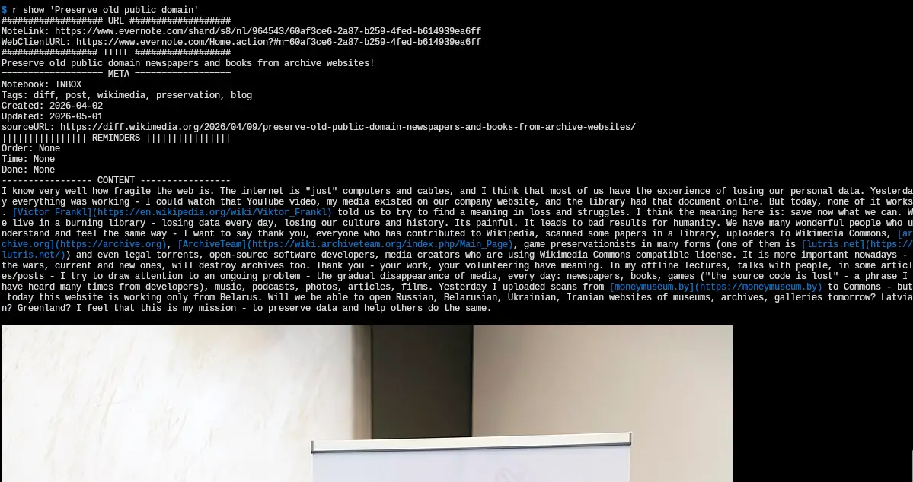

Rust rewrite of https://github.com/vitaly-zdanevich/geeknote

Reeknote for Evernote
===

Reeknote is a command-line client for Evernote. It is intended for Linux,
FreeBSD, macOS, and other systems where a Rust binary can run.

It allows you to:

* create notes in your Evernote account;
* create tags and notebooks;
* search Evernote from the console using filters;
* show notes in the terminal;
* edit notes using any editor, such as nano, vim, emacs, or mcedit;
* download notes to local files with `rnsync`;
* use Evernote from cron jobs and scripts.

This document shows how to work with Evernote notes, notebooks, tags, and
`rnsync` using Reeknote.



## Installation

### Build From Source

Install the stable Rust toolchain, then build both binaries:

```sh
cargo build --release --bins
```

The binaries will be written to:

* `target/release/reeknote`
* `target/release/rnsync`

To build only one binary:

```sh
cargo build --release --bin reeknote
cargo build --release --bin rnsync
```

### Install With Cargo

When Reeknote is published on crates.io:

```sh
cargo install reeknote
```

This installs the `reeknote` and `rnsync` binaries into Cargo's binary
directory, usually `~/.cargo/bin`.

### Install Locally With Cargo

From the repository root:

```sh
cargo install --path .
```

This installs the local checkout's `reeknote` and `rnsync` binaries into
Cargo's binary directory, usually `~/.cargo/bin`.

### Install With Nix

From this repository:

```sh
nix profile install .#reeknote
```

To run without installing:

```sh
nix run .#reeknote
nix run .#rnsync -- --help
```

After Reeknote is accepted into Nixpkgs, install it from Nixpkgs:

```sh
nix profile install nixpkgs#reeknote
```

### Install With Homebrew

Reeknote includes a Homebrew formula for installing from a tap:

```sh
brew tap vitaly-zdanevich/reeknote https://gitlab.com/vitaly-zdanevich/reeknote.git
brew install reeknote
```

For audio playback support, install `mpv` too:

```sh
brew install mpv
```

### Install With APT

The GitLab Pages APT repository is intended for Debian 12, Ubuntu 24.04, and
newer compatible distributions on `amd64` and `arm64`.

```sh
sudo apt install ca-certificates curl gnupg
sudo install -d -m 0755 /etc/apt/keyrings
curl -fsSL https://vitaly-zdanevich.gitlab.io/reeknote/reeknote-archive-keyring.asc \
  | sudo gpg --dearmor -o /etc/apt/keyrings/reeknote.gpg
echo "deb [signed-by=/etc/apt/keyrings/reeknote.gpg] https://vitaly-zdanevich.gitlab.io/reeknote stable main" \
  | sudo tee /etc/apt/sources.list.d/reeknote.list >/dev/null
sudo apt update
sudo apt install reeknote
```

### Install With Snap

Reeknote and rnsync are published as separate classic-confinement snaps:

```sh
sudo snap install reeknote --classic
sudo snap install rnsync --classic
```

Classic confinement is used because Reeknote can launch local editors and `mpv`,
and rnsync writes notes to user-selected paths.

### FreeBSD Port Draft

A draft FreeBSD port lives in `packaging/freebsd`. It is not submitted to the
FreeBSD ports tree yet and must be validated on FreeBSD before submission.

### Install on Arch Linux

Reeknote is packaged for Arch Linux through the AUR. With an AUR helper:

```sh
yay -S reeknote
# Or:
paru -S reeknote
```

To install manually with `makepkg`, first install the usual AUR build tools:

```sh
sudo pacman -S --needed base-devel git
git clone https://aur.archlinux.org/reeknote.git
cd reeknote
makepkg -si
```

For audio playback and inline image display, install the optional tools too:

```sh
sudo pacman -S mpv kitty
```

### Install With Fedora Copr

After the Copr project is published:

```sh
sudo dnf install dnf-plugins-core
sudo dnf copr enable vitaly-zdanevich/reeknote
sudo dnf install reeknote
```

For audio playback and inline image display, install the optional tools too:

```sh
sudo dnf install mpv kitty
```

### Install With openSUSE OBS

After the OBS project is published:

```sh
sudo zypper addrepo https://download.opensuse.org/repositories/home:/vitaly-zdanevich:/reeknote/openSUSE_Tumbleweed/home:vitaly-zdanevich:reeknote.repo
sudo zypper refresh
sudo zypper install reeknote
```

For audio playback and inline image display, install the optional tools too:

```sh
sudo zypper install mpv kitty
```

### Install With pipx

Reeknote and rnsync can be installed from PyPI with `pipx`:

```sh
pipx install reeknote
pipx install rnsync
```

### Install With npm

Reeknote and rnsync can be installed from npm:

```sh
npm install -g reeknote
npm install -g @vitaly-zdanevich/rnsync
```

The npm packages currently provide Linux x64 and Linux ARM64 binaries.

### Uninstallation

If installed with `cargo install --path .`:

```sh
cargo uninstall reeknote
```

## Testing

Reeknote has a non-destructive unit test suite.

Run the tests with:

```sh
cargo test
```

Run formatting and lint checks with:

```sh
cargo fmt --check
cargo clippy --locked --all-targets --all-features -- -D warnings
```

## CI/CD

The GitLab CI pipeline in `.gitlab-ci.yml` runs:

* formatting checks;
* Clippy lints;
* Nix flake package builds;
* tests;
* Linux x86_64 release builds;
* Linux ARM64 release builds;
* Debian package builds for `amd64` and `arm64`;
* Fedora RPM package builds for `x86_64` and `aarch64`;
* openSUSE OBS package builds for Tumbleweed `x86_64`;
* Snap package builds for `reeknote` and `rnsync` on `amd64` and `arm64`;
* Linux x86_64 and ARM64 PyPI wheel builds for `reeknote` and `rnsync`;
* npm package builds for `reeknote` and `rnsync` on Linux x64 and ARM64;
* GitLab Pages APT repository publishing;
* Arch Linux AUR package publishing;
* Fedora Copr publishing when Copr credentials are configured;
* openSUSE OBS publishing when osc credentials are configured;
* Snap Store publishing when Snapcraft credentials are configured;
* crates.io package publishing for the `reeknote` Cargo package.

Each build uploads a temporary artifact containing `reeknote`, `rnsync`, and
a SHA-256 checksum. Version tag pipelines also upload those archives to the
GitLab Generic Package Registry and create a GitLab Release with durable
download links.

Released Linux binaries are available from the project's GitLab Releases page.
Release pipelines also publish `.deb`, `.rpm`, `.src.rpm`, and `.snap` packages
as GitLab Release assets and update the GitLab Pages APT repository.

Version tag pipelines publish PyPI wheels through PyPI Trusted Publishing. To
enable the first publish, configure PyPI pending publishers for projects
`reeknote` and `rnsync` with namespace `vitaly-zdanevich`, project `reeknote`,
workflow `.gitlab-ci.yml`, and environment `release`.

Version tag pipelines publish npm packages through npm Trusted Publishing. To
enable the first publish, configure npm trusted publishers for `reeknote`,
`reeknote-linux-x64`, `reeknote-linux-arm64`, `@vitaly-zdanevich/rnsync`,
`@vitaly-zdanevich/rnsync-linux-x64`, and
`@vitaly-zdanevich/rnsync-linux-arm64` with namespace `vitaly-zdanevich`,
project `reeknote`, CI file `.gitlab-ci.yml`, and environment `release`.

Version tag pipelines publish the Rust crate to crates.io with `cargo publish`.
Configure a protected masked GitLab CI variable named `CRATES_IO_TOKEN`
containing a crates.io API token with publish rights for the `reeknote` crate.
The crates.io package installs both `reeknote` and `rnsync`.

Version tag pipelines publish the APT repository through GitLab Pages. Configure
a protected GitLab CI variable named `APT_GPG_PRIVATE_KEY` containing the
ASCII-armored private key used to sign the repository. A File-type variable is
recommended; the CI accepts either a file variable path or the key text itself.
If the key is protected with a passphrase, also configure `APT_GPG_PASSPHRASE`.

Version tag pipelines publish the Arch Linux AUR package by updating the AUR
Git repository for `reeknote`. Configure a protected masked GitLab CI variable
named `AUR_SSH_PRIVATE_KEY` containing a private SSH key whose public key is
registered in the AUR account. A File-type variable is recommended; the CI
accepts either a file variable path or the key text itself. The first successful
push creates the AUR package if it does not already exist. Optionally configure
`AUR_SSH_KNOWN_HOSTS` to pin the AUR SSH host key instead of using `ssh-keyscan`.

Version tag pipelines publish the Fedora source RPM to Copr when Copr
credentials are configured. Create the Copr project first, then configure a
protected masked GitLab CI variable named `COPR_CONFIG` containing the
`~/.config/copr` credentials file. A File-type variable is recommended; the CI
accepts either a file variable path or the file text itself. The job builds the
project named `reeknote` by default; set `COPR_PROJECT` if the Copr project name
or owner-qualified project name is different, such as `user/reeknote`.

Version tag pipelines publish the openSUSE source package to OBS when osc
credentials are configured. Create the OBS project and package first, then
configure a protected masked GitLab CI variable named `OSC_CONFIG` containing
the `~/.config/osc/oscrc` credentials file. A File-type variable is recommended;
the CI accepts either a file variable path or the file text itself. The job uses
project `home:vitaly-zdanevich:reeknote` and package `reeknote` by default; set
`OBS_PROJECT`, `OBS_PACKAGE`, or `OBS_APIURL` if your OBS project layout differs.

Version tag pipelines publish separate `reeknote` and `rnsync` snaps to the Snap
Store when Snapcraft credentials are configured. Register both snap names first,
then configure a protected masked GitLab CI variable named
`SNAPCRAFT_STORE_CREDENTIALS` containing credentials from `snapcraft
export-login`. A File-type variable is recommended; the CI accepts either a file
variable path or the credentials text itself. The job publishes to `stable` by
default; set `SNAPCRAFT_CHANNEL` to publish to another channel. Because these
snaps use classic confinement, the first store release requires Snap Store
classic-confinement approval.

```sh
snapcraft export-login \
  --snaps=reeknote,rnsync \
  --acls=package_access,package_push,package_update,package_release \
  --channels=stable \
  snapcraft-login
```

The local Nix flake builds the same Rust package shape intended for a future
Nixpkgs pull request. Nixpkgs publishing is not automatic from this repository;
it still requires a reviewed pull request to `NixOS/nixpkgs`.

The runner tags in `.gitlab-ci.yml` target GitLab.com hosted Linux runners. If
this project uses self-managed or differently tagged runners, adjust the
`tags` values.

## Reeknote Settings

### Authorizing Reeknote

After installation, Reeknote must be authorized with Evernote before use. To
authorize, run:

```sh
reeknote login
```

This starts the authorization process. Reeknote asks for a developer token or
uses OAuth, then stores the token in the local database. Re-authorization is not
required unless you log out or change users.

After authorization, you can start to work with Evernote.

### Logging Out And Changing Users

To change Evernote users, run:

```sh
reeknote logout
```

Afterward, repeat the authorization step.

### Yinxiang Biji Notes

To use Evernote's separate service in China, Yinxiang Biji, set
`REEKNOTE_BASE` to `yinxiang`.

```sh
REEKNOTE_BASE=yinxiang reeknote login

# Or:
export REEKNOTE_BASE=yinxiang
reeknote ...commands...
```

Yinxiang Biji can be faster in China and supports Chinese payment methods. Be
aware that its data is stored on servers in China.

### Login With A Developer Token

Reeknote can use an Evernote developer token:

```sh
EVERNOTE_DEV_TOKEN=... reeknote login
```

You can request Evernote API access from Evernote Developer Support. When asked
for the application name, use `reeknote`.

### Examining Your Settings

```sh
$ reeknote settings
Reeknote
******************************
Version: 3.0.24
App dir: /home/username/.reeknote
Error log: /home/username/.reeknote/error.log
Editor: nano
Markdown2 Extras: None
Note extension: [".markdown", ".org"]
******************************
Username: username
Id: 11111111
Email: example@example.com
```

### Setting Up The Default Editor

You can edit notes in console editors in plain text or Markdown format.

Check the current editor:

```sh
reeknote settings --editor
```

Change the default editor:

```sh
reeknote settings --editor vim
```

To use `gvim`, prevent forking from the terminal with `-f`:

```sh
reeknote settings --editor 'gvim -f'
```

Example:

```sh
$ reeknote settings --editor
Current editor is: nano
$ reeknote settings --editor vim
Changes saved.
$ reeknote settings --editor
Current editor is: vim
```

### Enabling Markdown Extras

Check the currently enabled Markdown extras:

```sh
reeknote settings --extras
```

Change them:

```sh
reeknote settings --extras "tables, footnotes"
```

Example:

```sh
$ reeknote settings --extras
Current markdown2 extras is : None
$ reeknote settings --extras "tables, footnotes"
Changes saved.
```

## Working With Notes

### Notes: Creating Notes

The main functionality is creating notes in Evernote.

Synopsis:

```sh
reeknote create --title <title>
                [--content <content>]
                [--tag <tag>]
                [--created <date and time>]
                [--resource <attachment filename>]
                [--notebook <notebook where to save>]
                [--reminder <date and time>]
                [--url <url>]
                [--raw]
                [--rawmd]
```

Options:

| Option | Argument | Description |
|--------|----------|-------------|
| `--title` | title | Title of the new note. |
| `--content` | content | Content of the new note. If omitted, Reeknote opens your editor. |
| `--tag` | tag | Tag for the note. May be repeated. |
| `--created` | date | Creation date in `yyyy-mm-dd` or `yyyy-mm-dd HH:MM` format. |
| `--resource` | filename | File to attach to the note. May be repeated. |
| `--notebook` | notebook | Notebook where the note should be saved. |
| `--reminder` | date | Reminder date/time. Also supports `TOMORROW`, `WEEK`, `NONE`, and `DONE`. |
| `--url` | url | Source URL for the note. |
| `--raw` | | Treat content as raw ENML. |
| `--rawmd` | | Treat content as raw Markdown. |

Example:

```sh
reeknote create --title "Shopping list" \
                --content "Don't forget to buy milk, turkey and chips." \
                --resource shoppinglist.pdf \
                --notebook "Family" \
                --tag "shop" --tag "holiday" --tag "important"
```

Create a note and edit the content in your editor:

```sh
reeknote create --title "Meeting with customer" \
                --notebook "Meetings" \
                --tag "projectA" --tag "important" --tag "report" \
                --created "2015-10-23 14:30"
```

### Notes: Searching For Notes

Search notes in Evernote and output results in the terminal.

Synopsis:

```sh
reeknote find --search <text to find>
              [--tag <tag>]
              [--notebook <notebook>]
              [--date <date or date range>]
              [--count <how many results to show>]
              [--exact-entry]
              [--content]
              [--reminders-only]
              [--deleted-only]
              [--ignore-completed]
              [--with-tags]
              [--with-notebook]
              [--with-url]
              [--guid]
```

`find` searches Evernote and remembers the last result. You can use the numeric
result ID for future commands.

Example:

```sh
$ reeknote find --search "Shopping"
Found 2 items
  1 : 2006-06-02 2009-01-19 Grocery Shopping List
  2 : 2015-02-22 2015-02-24 Gift Shopping List

$ reeknote show 2
```

Options:

| Option | Argument | Description |
|--------|----------|-------------|
| `--search` | text to find | Text to find. Use `*` for broad searches. |
| `--tag` | tag | Filter by tag. May be repeated. |
| `--notebook` | notebook | Filter by notebook. |
| `--date` | date or range | Filter by date, such as `yyyy-mm-dd` or `yyyy-mm-dd/yyyy-mm-dd`. |
| `--count` | count | Limit the number of displayed results. |
| `--content` | | Search by note content instead of title. |
| `--exact-entry` | | Search exact entries instead of fuzzy entries. |
| `--guid` | | Show GUID instead of numeric result index. |
| `--ignore-completed` | | Include only unfinished reminders. |
| `--reminders-only` | | Include only notes with reminders. |
| `--deleted-only` | | Include only deleted/trashed notes. |
| `--with-notebook` | | Show notebook name. |
| `--with-tags` | | Show tags. |
| `--with-url` | | Show Evernote web-client URL for each note. |

Examples:

```sh
reeknote find --search "How to patch KDE2" --notebook "jokes" --date 2015-10-14/2015-10-28
reeknote find --search "apt-get install apache nginx" --content --notebook "manual"
```

### Notes: Editing Notes

Edit notes in Evernote using any editor you like.

Synopsis:

```sh
reeknote edit --note <title or GUID of note to edit>
              [--title <the new title>]
              [--content <new content or "WRITE">]
              [--resource <attachment filename>]
              [--tag <tag>]
              [--created <date and time>]
              [--notebook <new notebook>]
              [--reminder <date and time>]
              [--url <url>]
              [--raw]
              [--rawmd]
```

Options:

| Option | Argument | Description |
|--------|----------|-------------|
| `--note` | title, GUID, or search result ID | Note to edit. If multiple notes match, Reeknote asks you to choose. |
| `--title` | new title | Rename the note. |
| `--content` | content or `WRITE` | Replace note content, or open the current content in an editor. |
| `--resource` | filename | Attach a file. May be repeated. Replaces existing resources. |
| `--tag` | tag | Set tags. May be repeated. Replaces existing tags. |
| `--created` | date | Set creation date in `yyyy-mm-dd` or `yyyy-mm-dd HH:MM` format. |
| `--notebook` | notebook | Move the note to another notebook. |
| `--reminder` | date | Set reminder date/time. Also supports `TOMORROW`, `WEEK`, `NONE`, `DONE`, and `DELETE`. |
| `--url` | url | Set the source URL. |
| `--raw` | | Treat content as raw ENML. |
| `--rawmd` | | Treat content as raw Markdown. |

Examples:

```sh
reeknote edit --note "Naughty List" --title "Nice List"
reeknote edit --note "Naughty List" --title "Nice List" --content "WRITE"
```

### Notes: Showing Note Content

Output any note in the terminal with `show`. Reeknote can show a note by title,
GUID, or previous search result ID. If a search finds multiple notes, Reeknote
asks you to choose.

When output goes to an interactive terminal, Reeknote visually highlights
Evernote code blocks, inline code, quote blocks, italic text, and bold text.
Inline links are rendered as blue Markdown links. Redirected output stays plain
Markdown text. In Kitty, image attachments are shown inline in the terminal.
Other terminals and redirected output show image placeholders with their file
names, such as `[Image: photo.png]`.

If a note has audio attachments and `show` is running in an interactive
terminal, Reeknote asks whether to play them with the local `mpv` player. When
you confirm, Reeknote downloads the audio attachment data to temporary files,
opens them in `mpv`, and removes the temporary files after playback exits.

Synopsis:

```sh
reeknote show <text, GUID, or previous search result ID>
```

Examples:

```sh
$ reeknote show "Shop*"

Found 2 items
  1 : Grocery Shopping List
  2 : Gift Shopping List
  0 : -Cancel-
: _
```

Use a previous search result:

```sh
$ reeknote find --search "Shop*"
Found 2 items
  1 : Grocery Shopping List
  2 : Gift Shopping List

$ reeknote show 2
################### URL ###################
NoteLink: evernote:///view/111/s1/note-guid/note-guid/
WebClientURL: https://www.evernote.com/shard/s1/nl/111/note-guid
################## TITLE ##################
Gift Shopping List
=================== META ==================
Notebook: Personal
Tags: shopping, gifts
Created: 2015-02-22
Updated: 2015-02-24
||||||||||||||| REMINDERS |||||||||||||||||
Order: None
Time: None
Done: None
---------------- CONTENT -----------------
Coffee
Chocolate
```

Raw ENML output:

```sh
reeknote show 2 --raw
```

### Notes: Removing Notes

Remove notes from Evernote.

Synopsis:

```sh
reeknote remove --note <note name or GUID>
                [--force]
```

Options:

| Option | Argument | Description |
|--------|----------|-------------|
| `--note` | note name, GUID, or search result ID | Note to delete. If multiple notes match, Reeknote asks you to choose. |
| `--force` | | Do not ask for confirmation. |

Example:

```sh
reeknote remove --note "Shopping list"
```

### Notes: De-duplicating Notes

Reeknote can preview duplicate notes.

Synopsis:

```sh
reeknote dedup [--notebook <notebook>]
```

Options:

| Option | Argument | Description |
|--------|----------|-------------|
| `--notebook` | notebook | Filter by notebook. |

This command currently previews duplicates and does not delete notes.

Example:

```sh
reeknote dedup --notebook Contacts
```

## Working With Linked Notebooks

### Linked Notes: Creating A Note

```sh
reeknote create-linked --notebook <linked notebook> --title <title>
```

### Linked Notes: Editing A Note

```sh
reeknote edit-linked --notebook <linked notebook> --note <note title>
```

## Working With Notebooks

### Notebooks: Showing The List Of Notebooks

```sh
reeknote notebook-list [--guid]
```

Options:

| Option | Argument | Description |
|--------|----------|-------------|
| `--guid` | | Show GUID instead of numeric result index. |

### Notebooks: Creating A Notebook

```sh
reeknote notebook-create --title <notebook title>
```

Options:

| Option | Argument | Description |
|--------|----------|-------------|
| `--title` | notebook title | Title of the new notebook. |
| `--stack` | stack | Optional notebook stack. |

Example:

```sh
reeknote notebook-create --title "Sport diets"
```

### Notebooks: Renaming A Notebook

```sh
reeknote notebook-edit --notebook <old name> --title <new name>
```

Options:

| Option | Argument | Description |
|--------|----------|-------------|
| `--notebook` | old name | Existing notebook to rename. |
| `--title` | new name | New notebook title. |

Example:

```sh
reeknote notebook-edit --notebook "Sport diets" --title "Hangover"
```

### Notebooks: Removing A Notebook

```sh
reeknote notebook-remove --notebook <notebook> [--force]
```

Options:

| Option | Argument | Description |
|--------|----------|-------------|
| `--notebook` | notebook | Notebook to delete. |
| `--force` | | Do not ask for confirmation. |

Example:

```sh
reeknote notebook-remove --notebook "Sport diets" --force
```

## Working With Tags

### Tags: Showing The List Of Tags

```sh
reeknote tag-list [--guid]
```

Options:

| Option | Argument | Description |
|--------|----------|-------------|
| `--guid` | | Show GUID instead of numeric result index. |

### Tags: Creating A New Tag

```sh
reeknote tag-create --title <tag name to create>
```

Options:

| Option | Argument | Description |
|--------|----------|-------------|
| `--title` | tag name | Name of the tag to create. |

Example:

```sh
reeknote tag-create --title "Hobby"
```

### Tags: Renaming A Tag

```sh
reeknote tag-edit --tagname <old name> --title <new name>
```

Options:

| Option | Argument | Description |
|--------|----------|-------------|
| `--tagname` | old name | Existing tag to rename. |
| `--title` | new name | New tag name. |

Example:

```sh
reeknote tag-edit --tagname "Hobby" --title "Girls"
```

### Tags: Removing A Tag

```sh
reeknote tag-remove --tagname <tag name> [--force]
```

Options:

| Option | Argument | Description |
|--------|----------|-------------|
| `--tagname` | tag name | Existing tag to remove. |
| `--force` | | Do not ask for confirmation. |

## rnsync - Synchronization App

`rnsync` is an additional application built with Reeknote. In this Rust client,
`rnsync` currently downloads notes to local files. It does not create, update,
or delete Evernote notes.

Synopsis:

```sh
rnsync --path <path to directory>
       [--mask <unix shell-style wildcard, such as *.md>]
       [--format <plain|markdown|html>]
       [--notebook <notebook>]
       [--all]
       [--all-linked]
       [--count <count>]
       [--download-only]
       [--save-images]
       [--images-in-subdir]
```

Options:

| Option | Argument | Description |
|--------|----------|-------------|
| `--path` | directory | Directory where notes will be downloaded. |
| `--mask` | wildcard | File mask used by local sync helpers. |
| `--format` | `plain`, `markdown`, or `html` | Output format. |
| `--notebook` | notebook | Notebook to download. |
| `--all` | | Download all regular notebooks into subdirectories. |
| `--all-linked` | | Download all linked notebooks into subdirectories. |
| `--count` | count | Maximum notes to download per notebook/search. |
| `--download-only` | | Accepted for compatibility; the Rust implementation is download-only. |
| `--save-images` | | Save image resources referenced by notes. |
| `--images-in-subdir` | | Save images into a per-note image subdirectory. |

Examples:

```sh
rnsync --path ~/notes --notebook "Work" --format markdown --download-only
rnsync --path ~/evernote-backup --all --format html --save-images --images-in-subdir
```

## Original Contributors

* Vitaliy Rodnenko
* Simon Moiseenko
* Ivan Gureev
* Roman Gladkov
* Greg V
* Ilya Shmygol

## Evernote Related Projects Worth Mentioning

* [NixNote: GUI, storing notes in SQLite, written in C++](https://github.com/vitaly-zdanevich/nixnote2)
* [CLInote: CLI, written in Go](https://github.com/TcM1911/clinote)
* [Telegram self-hosted bot, read-only](https://gitlab.com/vitaly-zdanevich/bot_telegram_evernote)
